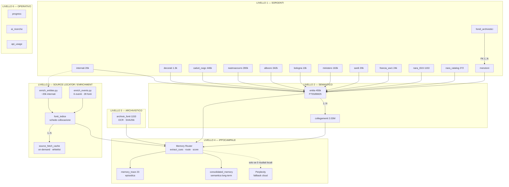

# Architettura del Database - IMI Extractor

Database: **SQLite** (`imi_internati.db`) — motore relazionale a file singolo, WAL mode, 64 MB cache, 256 MB mmap.
**Dimensione: ~1.4 GB** · **25+ tabelle** · **~4.8M record totali**

## Panoramica

Il sistema raccoglie e collega dati su caduti, internati e decorati della Prima e Seconda Guerra Mondiale da fonti multiple. L'architettura si divide in **sei livelli logici**, ispirata alla struttura della memoria umana:

1. **Livello Sorgenti (Source Tables)** — una tabella per ogni fonte dati primaria
2. **Livello Semantico (Entity Layer)** — entità normalizzate e grafo di collegamenti cross-dataset
3. **Livello Archivistico (Archivio Fonti)** — documenti originali scansionati con metadati militari
4. **Livello Ippocampale (Memory Router)** — routing intelligente delle query, traccia episodica, memoria consolidata
5. **Livello Source Locator (Indice Leggero)** — catalogo di fonti esterne non scaricate, fetch on-demand
6. **Livello Operativo** — tracking avanzamento, log AI, usage crediti

---

## LIVELLO 1 - Tabelle Sorgente

### `internati` (IMI - Archivio di Stato Bolzano)
Internati Militari Italiani. ~20.464 record.

| Colonna | Tipo | Note |
|---|---|---|
| id | INTEGER PK | autoincrement |
| lettera | TEXT | lettera alfabetica del volume |
| file_pdf | TEXT | file PDF origine |
| pagina | INTEGER | pagina nel PDF |
| cognome, nome, data_nascita, luogo_nascita, residenza, grado, luogo_cattura, data_cattura, luogo_internamento, matricola, arbeitskommando, mansione, sorte, data, documenti | TEXT | campi anagrafici/militari |
| raw_text | TEXT | testo OCR grezzo |
| elaborato_il | TEXT | timestamp |
| needs_review, review_reason, luogo_validato | INTEGER/TEXT | controllo qualità |

### `decorati` (ISTORECO - Albi della Memoria)
Decorati al Valor Militare. ~1.286 record.

Campi chiave: `source_id` (UNIQUE), `albo_id`, `cognome`, `nome`, `comune_nascita`, `data_morte`, `guerra`, `grado`, `corpo_militare`, `decorazione`, `motivazione`, `causa_morte`, `luogo_morte`, `luogo_internamento`, `url_scheda`, `raw_json`.

### `caduti_albooro` (Cimeetrincee / cadutigrandeguerra.it)
Albo d'Oro dei Caduti della Grande Guerra. **342.555 record** (in corso, target ~530k).
Paginazione per volume regionale + lettera alfabetica A-Z.

Campi chiave: `nominativo`, `volume`, `dettaglio`, `link_scheda`, `elaborato_il`.

### `caduti_bologna` (Museo del Risorgimento Bologna)
Caduti bolognesi 1915-1918. **9.656 record** (in corso, target 10.732).

Campi chiave: `nome`, `paternita`, `grado`, `reparto`, `luogo_nascita`, `anno_nascita`, `luogo_dimora`, `causa_morte`, `luogo_morte`, `data_morte`, `professione`, `stato_civile`, `decorazioni`, `scheda_completa`.
UNIQUE(nome, paternita, data_morte).

### `caduti_ministero` (Ministero della Difesa - Onorcaduti)
Banca Dati Caduti e Dispersi 1a GM. **162.646 record**.

Campi chiave: `cognome`, `nome`, `paternita`, `luogo_nascita`, `data_nascita`, `luogo_residenza`, `grado`, `reparto`, `data_morte`, `luogo_morte`, `causa_morte`, `decorazioni`, `scheda_url`.
UNIQUE(cognome, nome, data_morte, luogo_nascita).

### `caduti_sardi` (Unione Sarda - Eroi e Caduti Sardi)
Caduti sardi della Grande Guerra. **20.435 record**.

Campi chiave: `cognome`, `nome`, `paternita`, `luogo_nascita`, `comune_residenza`, `grado`, `reparto`, `data_morte`, `luogo_morte`, `causa_morte`, `decorazioni`, `scheda_url`.
UNIQUE(cognome, nome, data_morte, luogo_nascita).

### `caduti_cwgc` (Commonwealth War Graves Commission)
Caduti Commonwealth WW1+WW2. **~1.07M record** (completato per le nazionalità principali, UK WW2 chiuso a 401k). Paginazione HTML + export CSV per nazionalità.

Campi chiave: `cwgc_id` (UNIQUE), `nome`, `cognome`, `rank`, `service_number`, `service`, `regiment`, `nationality`, `data_morte`, `eta`, `cimitero`, `paese_cimitero`, `guerra`.

### `documenti_nara_t315` (NARA T315 — Divisioni italiane)
Frame OCR da microfilm NARA T315. **1.153 record** (completato).

Campi chiave: `roll`, `frame`, `testo_ocr`, `lingua`, `affidabilita_ocr`, `unita_principale`, `teatro`, `data_documento`, `tipo_documento`.

### `documenti_nara_catalog` (NARA Catalog API)
Metadati After Action Reports e Unit Journals, unità USA in Italia WW2. **272 record** (10 query tematiche: AAR Italy, AAR Sicily, AAR Anzio, AAR Cassino, 36th Div, 45th Div, Italian Internees, Italian Armistice, ecc.).

Campi chiave: `na_id` (UNIQUE), `title`, `description`, `record_group`, `series`, `inclusive_dates`, `unit`, `document_type`, `has_digital_objects`, `file_urls`, `search_query`.

### `decorati_nastroazzurro` (Nastro Azzurro / Ministero Difesa)
Decorati al Valor Militare. **279.832 record** (completato).

Campi chiave: `id_decorato`, `cognome`, `nome`, `data_nascita`, `luogo_nascita`, `grado`, `arma`, `reparto`, `tipo_decorazione`, `motivazione`, `data_decreto`, `conflitto`.

### `caduti_francia_ww1` (Mémoire des Hommes — Francia)
Caduti francesi della Prima Guerra Mondiale. **24.279 record**.

Campi chiave: `cognome`, `nome`, `data_nascita`, `luogo_nascita`, `data_morte`, `luogo_morte`, `corpo`, `grado`, `url_scheda`.

### `fondi_archivistici` (Ufficio Storico SME)
Fondi documentali digitalizzati.

Campi chiave: `codice_fondo`, `titolo`, `file_pdf`, `url`, `pagina`, `descrizione`, `periodo`, `busta`, `fascicolo`, `luoghi`, `raw_text`.

### `menzioni` (estratte dai fondi)
Persone/luoghi menzionati nei fondi archivistici.
**FK** `fondo_id` → `fondi_archivistici(id)`.

Campi chiave: `tipo`, `cognome`, `nome`, `grado`, `reparto`, `luogo`, `data`, `contesto`.

### `fonti_narrative` (fonti personali e narrative dal Desktop)
Documenti personali, corrispondenza, fotografie, memorie e biografie integrati dal Desktop dell'utente. **40 record**.

Alimentata dallo script `import_personal_sources.py`:
- raccolta file da directory Desktop prefissate;
- deduplicazione via `sha256`;
- estrazione testo nativo per `.odt`/`.docx`;
- OCR Mistral per `.pdf`/`.jpg`/`.jpeg`/`.png`/`.tiff`;
- classificazione di `tipo_fonte` e `archivio` dal percorso;
- rilevamento euristico delle persone menzionate (`soggetti_json`, `persone_possibili`);
- inserimento nello star schema tramite `entita` e `collegamenti` (`tabella_origine='fonti_narrative'`).

| Colonna | Tipo | Note |
|---|---|---|
| id | INTEGER PK | autoincrement |
| sha256 | TEXT UNIQUE | hash contenuto file |
| nome_file, path_locale | TEXT | nome e percorso fisico |
| formato | TEXT | odt/docx/pdf/jpg/png/tiff |
| tipo_fonte | TEXT | biografia/corrispondenza/foto/memoriale/riferimento |
| archivio, fondo | TEXT | provenienza (es. "Desktop — ARCHIVIO STORIE") |
| autore | TEXT | autore/destinatario se rilevabile |
| soggetti_json | TEXT (JSON) | persone estratte strutturate |
| persone_possibili | TEXT | persone rilevate in formato testo per LIKE search |
| titolo, descrizione | TEXT | titolo e descrizione normalizzati |
| testo_ocr | TEXT | testo estratto/OCR completo |
| ocr_status | TEXT | done/pending/skip_quality |
| data_documento | TEXT | data rilevata/derivata |
| elaborato_il | TEXT | timestamp import |

Indici su: `tipo_fonte`, `persone_possibili`, `archivio`, `data_documento`, `ocr_status`.

### `lettere_personali` (lettere e diari personali OCR)
Lettere, cartoline e diari personali estratti con OCR dal modulo `import_ocr_lettere`. **1 record** (migrato da `ocr_lettere.db`).

Alimentata dallo script `import_lettere_personali.py`:
- lettura dalla tabella `lettere` di `import_ocr_lettere/ocr_lettere.db`;
- deduplicazione via `sha256` del file originale;
- inserimento nello star schema tramite `entita` (`mittente`, `destinatario`, `luogo`, persone estraibili dal `corpo_testo`) e `collegamenti` (`tabella_origine='lettere_personali'`).

| Colonna | Tipo | Note |
|---|---|---|
| id | INTEGER PK | autoincrement |
| filename | TEXT | nome file originale |
| file_path | TEXT | percorso fisico |
| mittente, destinatario | TEXT | persone coinvolte |
| data_lettera, luogo | TEXT | contesto spazio-temporale |
| oggetto | TEXT | oggetto/intestazione |
| corpo_testo | TEXT | testo OCR completo |
| note, lingua, confidenza | TEXT/REAL | metadati OCR |
| raw_response | TEXT | risposta grezza del modello OCR |
| sha256 | TEXT UNIQUE | hash file originale |
| sorgente_db, sorgente_id | TEXT/INTEGER | tracciabilita' origine |
| elaborato_il | TEXT | timestamp import |

Indici su: `mittente`, `destinatario`, `luogo`, `data_lettera`.

---

## LIVELLO 2 - Livello Semantico (Cross-Dataset)

### `entita`
Entità normalizzate (persone, luoghi, eventi) estratte da TUTTI i dataset. **~688.738 record**.
Distribuzione: persona 560.133 · luogo 102.319 · evento 14.952 · unita 10.348 · periodo 920 · decorazione 66.
Deduplicazione tramite `valore_normalizzato` + `tipo`. Alimentato dal linker in background e dagli script `import_personal_sources.py` (`fonti_narrative`) e `import_lettere_personali.py` (`lettere_personali`).

| Colonna | Tipo | Note |
|---|---|---|
| id | INTEGER PK | |
| tipo | TEXT | persona / luogo / evento |
| valore | TEXT | valore originale |
| valore_normalizzato | TEXT | chiave dedup (lowercase, trim) |
| cognome, nome, data, luogo, contesto | TEXT | metadati |
| fonte_tabella, fonte_id | TEXT/INTEGER | record origine |

### `collegamenti`
Grafo che collega ogni entità ai record sorgente. **~4.832.063 archi**.
Distribuzione per tabella: internati 574.141 · caduti_ministero 1.499.794 · caduti_albooro 1.359.175 · caduti_cwgc 1.073.575 · caduti_sardi 126.860 · decorati 42.040 · fondi_archivistici 68.399 · menzioni 54.854 · fonti_narrative 69 · lettere_personali 0 (1 record migrato, nessun mittente/destinatario estratto dalla lettera OCR campione).
**FK** `entita_id` → `entita(id)`.

| Colonna | Tipo | Note |
|---|---|---|
| id | INTEGER PK | |
| entita_id | INTEGER FK | → entita |
| tabella_origine | TEXT | nome tabella sorgente |
| record_id | INTEGER | id record sorgente |
| tipo_collegamento | TEXT | |
| confidenza | REAL | 0.0–1.0 |

**Questo è il cuore relazionale**: `entita` + `collegamenti` formano una struttura a stella (star schema) che permette di trovare la stessa persona/luogo attraverso dataset diversi. Ricercabile via **FTS5/BM25** (`idx_entita_search`).

---

## LIVELLO 3 - Archivio Fonti (Documenti Originali)

### `archivio_fonti`
Documenti scansionati originali con metadati militari. **1.153 record**.
Distribuzione tipo_documento: Tätigkeitsbericht 234 · Befehl 217 · Lagebericht 178 · Altro 177 · Fernspruch 158 · Separatore 74 · Karte 48 · Fernschreiben 43 · Tagesmeldung 8 · Entwurf 3.
File fisici in `archivio_storage/{sha256[:2]}/`.

| Colonna | Tipo | Note |
|---|---|---|
| id | INTEGER PK | |
| sha256 | TEXT UNIQUE | hash contenuto file |
| nome_file | TEXT | filename originale |
| formato | TEXT | pdf/jpeg/tiff/png |
| archivio | TEXT | NARA/TNA/AUSSME/… |
| fondo | TEXT | es. T315 |
| unita_principale | TEXT | reparto documentato |
| teatro | TEXT | Italy/Balkans/… |
| data_documento | TEXT | |
| tipo_documento | TEXT | diario/aar/fernspruch/… |
| ocr_status | TEXT | done/partial/skip_cursive/skip_quality/pending |
| testo_ocr | TEXT | testo estratto |
| path_locale | TEXT | percorso fisico |

---

## LIVELLO 4 - Livello Ippocampale (Memory Router)

Ispirato al funzionamento dell'ippocampo umano: **non recupera mai più testo del necessario**.
Ogni query viene scomposta in cue strutturati e instradata verso il layer più economico.

### Pipeline di routing

```
QUERY UTENTE
    ↓ extract_cues()
  persona · reparto · luogo · data · guerra · archivio · tipo_doc
    ↓ _select_route()
  [1] sql_exact      → ricerca esatta internati/cwgc/decorati/menzioni/fonti_narrative
  [2] fts / BM25     → FTS5 su idx_entita_search (sub-ms)
  [3] graph          → get_entity_network() depth≤2
  [4] archivio_fonti → documenti originali scansionati
  [5] fonti_narrative → fonti personali/narrative del Desktop (OCR completo)
  [6] perplexity     → fallback cloud SOLO se 0 risultati locali verificati
    ↓ _score_and_merge()
  score = metadata_exactness + BM25 + graph_proximity + source_quality
    ↓ risposta JSON   confidence · verified_sources · need_cloud_ai
```

### `memory_trace`
Traccia episodica — ogni ricerca loggata. Analogo alla memoria episodica dell'ippocampo. **23 query tracciate**.

| Colonna | Tipo | Note |
|---|---|---|
| id | INTEGER PK | |
| query_text | TEXT | query originale |
| cues_json | TEXT | cue estratti (JSON) |
| route_json | TEXT | layer attivati |
| sources_count | INTEGER | fonti trovate |
| confidence | REAL | 0.0–1.0 |
| response_ms | INTEGER | tempo risposta |
| tokens_saved_estimate | INTEGER | token AI risparmiati |
| used_cloud_ai | INTEGER | 0/1 |
| created_at | TEXT | timestamp |

### `consolidated_memory`
Memoria semantica consolidata — sintesi stabili per topic ricorrenti (≥3 occorrenze).
Analogo alla memoria semantica neocorticale. **1 topic consolidato**.

| Colonna | Tipo | Note |
|---|---|---|
| id | INTEGER PK | |
| topic_key | TEXT UNIQUE | chiave topic (persona+reparto+anno) |
| cues_json | TEXT | cue tipo per quel topic |
| synthesis | TEXT | risposta consolidata |
| source_count | INTEGER | fonti aggregate |
| query_count | INTEGER | volte ricercato |
| last_updated | TEXT | ultimo aggiornamento |

---

## LIVELLO 5 - Source Locator (Indice Leggero Fonti Esterne)

Il DB locale è un **catalogo/mappa**, non un magazzino. Le fonti esterne restano online;
viene salvata solo la "scheda di collocazione". Il backend scarica on-demand solo da
domini autorizzati (l'AI non scarica mai direttamente).

### `fonti_indice`
Scheda di collocazione di fonti esterne. **1 record** (avviato).

| Colonna | Tipo | Note |
|---|---|---|
| id | INTEGER PK | |
| archivio, fondo, serie, segnatura | TEXT | collocazione archivistica |
| titolo, tipo_fonte | TEXT | descrizione fonte |
| soggetti_collegati, persone_possibili | TEXT (JSON) | chi/cosa riguarda |
| reparto, luogo, data_inizio, data_fine | TEXT | contesto militare/temporale |
| url_catalogo, url_file, iiif_manifest | TEXT | URL recupero |
| page_start, page_end | INTEGER | pagine/frame specifici |
| hash_se_disponibile | TEXT | hash se file già locale |
| access_type | TEXT | online / login / richiesta / locale |
| fetch_status | TEXT | mai_scaricato / scaricato / non_accessibile / errore |
| confidence | REAL | 0.0–1.0 |
| last_checked_at, created_at | TEXT | timestamp |

### `source_fetch_cache`
Cache dei file scaricati on-demand.

| Colonna | Tipo | Note |
|---|---|---|
| id | INTEGER PK | |
| source_id | INTEGER FK | → fonti_indice |
| url_fetched | TEXT | URL effettivamente scaricato |
| path_file | TEXT | percorso locale cache |
| sha256 | TEXT | hash contenuto |
| size_bytes | INTEGER | |
| content_type | TEXT | |
| permanent | INTEGER | 0=temporanea, 1=permanente |
| fetched_at | TEXT | |
| expires_at | TEXT | scadenza cache |

### Pipeline Source Locator

```
QUERY UTENTE
    ↓ find_candidate_sources()
  estrae cue (persona, reparto, luogo, data, archivio)
  cerca in fonti_indice (solo metadati, sub-ms)
    ↓ classificazione disponibilità
  'locale'        = già in cache
  'richiamabile'  = online + dominio autorizzato
  'da_richiedere' = login/richiesta/non autorizzato
    ↓ fetch_source_on_demand()  [solo se serve, solo backend]
  scarica da whitelist domini · max 50MB · sha256
    ↓ build_minimal_context_for_ai()
  metadati sempre · excerpt solo se testuale in cache
  AI riceve minimo indispensabile · documento originale = fonte primaria
```

### Pipeline di Arricchimento Automatico (fonti esterne)

Due script batch arricchiscono gli `internati` collegandoli a fonti esterne autorizzate.

**1. Arricchimento per entità (`enrich_entities.py`)**
```
internati
  ↓ SELECT slice (nome, cognome, data_nascita, luogo_nascita, residenza,
     luogo_cattura, luogo_internamento, arbeitskommando)
  ↓ _build_query()  → query federata nome+luoghi+eventi
  ↓ federated_search()  → TNA, Europeana, Antenati, DDB, Mémoire des Hommes,
                          Grand Mémorial, IWM Lives, ecc.
  ↓ register_source_metadata()  → upsert in fonti_indice
     soggetti_collegati = "<nome> <cognome> <luoghi>"
  ↓ state saved in enrich_entities_state.json
```
- Copertura: ~20.390 internati
- Risultati: ~19.900 schede correlate (principale provider TNA Discovery)
- Concorrenza: 5 worker, rate-limit 0.5s, resume automatico

**2. Arricchimento per eventi (`enrich_events.py`)**
```
EVENTI CURATI (Cefalonia, Mauthausen/Gusen, Tobruk, ARMIR Russia,
                Operazione Achse, lavoro forzato)
  ↓ per ogni evento: fonti italiane + Asse/Berlinesi + Alleate
  ↓ register_source_metadata()  → upsert in fonti_indice
     soggetti_collegati = "<nome evento>"
```
- Risultati: ~28 schede multilaterali (ANPI/USSME, Bundesarchiv/Arolsen,
  TNA/NARA/AWM/USHMM)

Entrambe le pipeline rispettano i vincoli:
- **no bulk scraping** su fonti con ToS restrittivi
- **solo metadati + URL diretto**, nessun download massivo
- **rate limiting** e retry controllati
- **dominio whitelist** per eventuali fetch on-demand

### Domini autorizzati (whitelist backend)
`dam-antenati.cultura.gov.it` · `iiif-antenati.cultura.gov.it` · `antenati.cultura.gov.it` ·
`catalog.archives.gov` · `s3.amazonaws.com` (NARA media) · `www.cwgc.org` ·
`www.cadutigrandeguerra.it` · `decoratialvalormilitare.istitutonastroazzurro.org` · `archive.org`

---

## LIVELLO 6 - Tabelle Operative

### `progress`
Tracciamento avanzamento estrazioni (per lettera IMI o fondo).
Campi: `lettera` (PK), `total_pages`, `processed_pages`, `status`, `started_at`, `finished_at`.

### `ai_ricerche`
Log delle ricerche AI multi-provider (OpenAI, Mistral, Perplexity).
Campi: `query`, `provider`, `model`, `risposta`, `contesto_dati`, `cost_usd`, `elaborato_il`.

### Research-to-Index (auto-indexing ricerche senza risultato locale)

#### `research_subjects`
Soggetti di ricerca creati automaticamente quando una query non trova risultati nel DB locale.
**50 record** (test su 50 soldati).

| Colonna | Tipo | Note |
|---|---|---|
| id | INTEGER PK | autoincrement |
| subject_type | TEXT | soldier / event / unit / document / place |
| name | TEXT | nome/query del soggetto |
| normalized_name | TEXT | chiave dedup (lowercase, trim) |
| date_start | TEXT | data inizio (se nota) |
| date_end | TEXT | data fine (se nota) |
| place | TEXT | luogo (se noto) |
| unit | TEXT | unita' militare (se nota) |
| status | TEXT | not_verified / partially_verified / verified |
| confidence | REAL | 0.0-1.0 (ricalcolata da fonti collegate) |
| created_from_query | TEXT | query originale che ha generato il soggetto |
| linked_soldier_id | INTEGER | FK a internati.id (se collegato a soldato esistente) |
| created_at | TEXT | timestamp |
| updated_at | TEXT | timestamp |

Indici: `idx_rs_type`, `idx_rs_status`, `idx_rs_soldier`.

#### `research_subject_sources`
Collegamento tra soggetti di ricerca e fonti indicizzate in `fonti_indice`.
**1.174 record** (test su 50 soldati).

| Colonna | Tipo | Note |
|---|---|---|
| id | INTEGER PK | |
| subject_id | INTEGER FK | → research_subjects |
| source_locator_id | INTEGER FK | → fonti_indice |
| relation_type | TEXT | confirms / mentions / possibly_related / contradicts |
| confidence | REAL | 0.0-1.0 |
| evidence_note | TEXT | nota sull'evidenza (provider, score, match) |
| created_at | TEXT | timestamp |

Indici: `idx_rss_subject`, `idx_rss_source`.

#### `research_gaps`
Campi mancanti per ogni soggetto, con suggerimento provider per riempirli.
**200 record** (test su 50 soldati).

| Colonna | Tipo | Note |
|---|---|---|
| id | INTEGER PK | |
| subject_id | INTEGER FK | → research_subjects |
| missing_field | TEXT | date_start / date_end / place / unit |
| suggested_provider | TEXT | antenati / cwgc / bundesarchiv |
| priority | TEXT | high / medium / low |
| status | TEXT | open / filled / obsolete |
| created_at | TEXT | timestamp |

Indici: `idx_rg_subject`, `idx_rg_status`.

#### Endpoint API Research-to-Index

| Metodo | Endpoint | Descrizione |
|---|---|---|
| POST | `/api/research/query` | Auto-index: cerca locale → se non trova, crea soggetto + arricchisce |
| POST | `/api/research/auto-index` | Forza creazione soggetto (anche se esiste in DB) |
| GET | `/api/research/subjects` | Lista soggetti (filtri: type, status, min_confidence) |
| GET | `/api/research/subjects/{id}` | Dettaglio soggetto con fonti e gaps |
| GET | `/api/research/subjects/{id}/dashboard` | Dashboard completa con arricchimento |
| PATCH | `/api/research/subjects/{id}` | Aggiorna status/confidence/campi |
| GET | `/api/research/gaps` | Lista gaps aperti con suggerimenti provider |
| GET | `/api/research/stats` | Statistiche Research-to-Index |

#### Flusso Research-to-Index

```
QUERY UTENTE
    ↓ search_all(query)
  [trovato?] → SI → ritorna risultati locali
              → NO ↓
    ↓ create_minimal_subject_from_query(query)
  soggetto creato (status=not_verified, confidence=0.1)
    ↓ federated_search(query, cues)
  20 provider interrogati
    ↓ per ogni risultato:
  upsert_source_locator → fonti_indice
  link_subject_to_source → research_subject_sources
    ↓ update_subject_confidence()
  confidence ricalcolata → status aggiornato
    ↓ identify_research_gaps()
  campi mancanti identificati → research_gaps
    ↓ ritorna dashboard soggetto
```

---

## Relazioni

```
fondi_archivistici (1) ──< (N) menzioni
entita (1) ──< (N) collegamenti
collegamenti.record_id ──> [internati | decorati | caduti_* | menzioni | nara_t315 | nastroazzurro]
memory_trace → (log) ogni chiamata a route_query()
consolidated_memory → (sintesi) topic ricorrenti da memory_trace
fonti_indice (1) ──< (N) source_fetch_cache
archivio_fonti ← (hash) → source_fetch_cache.sha256
research_subjects (1) ──< (N) research_subject_sources ──> fonti_indice
research_subjects (1) ──< (N) research_gaps
research_subjects.linked_soldier_id ──> internati.id
```

## Indici principali
- `idx_internati_cognome`, `idx_decorati_cognome`, `idx_nastroazzurro_cognome`
- `idx_menzioni_cognome`, `idx_menzioni_luogo`
- `idx_entita_valore` (valore_normalizzato), `idx_entita_tipo`
- `idx_collegamenti_entita`, `idx_collegamenti_record`
- `idx_cwgc_cognome`, `idx_nara_t315_frame`, `idx_nara_cat_naid`
- `idx_fi_reparto`, `idx_fi_luogo`, `idx_fi_archivio`, `idx_fi_fetch_status` (fonti_indice)
- `idx_sfc_source` (source_fetch_cache)
- `idx_rs_type`, `idx_rs_status`, `idx_rs_soldier` (research_subjects)
- `idx_rss_subject`, `idx_rss_source` (research_subject_sources)
- `idx_rg_subject`, `idx_rg_status` (research_gaps)
- **`idx_entita_search`** — FTS5 virtuale su `entita` (BM25 ranking)

---

## Pipeline Queries — Flusso End-to-End

### 1. Query utente → Memory Router
```
POST /api/memory/query  {query, use_cloud_fallback}
  → extract_cues(query)
    persona · reparto · luogo · data · guerra · archivio · tipo_doc
  → _select_route()
    [1] sql_exact      → internati, decorati, caduti_*, menzioni (WHERE exact)
    [2] fts / BM25     → idx_entita_search (sub-ms, ranking BM25)
    [3] graph          → get_entity_network() depth≤2 (grafo entita↔collegamenti)
    [4] archivio_fonti → documenti originali OCR (Lagebericht, KTB, ecc.)
    [5] fonti_indice   → source_locator.find_candidate_sources() (metadati esterni)
    [6] perplexity     → fallback cloud SOLO se 0 risultati locali verificati
  → _score_and_merge()
    score = metadata_exactness + BM25 + graph_proximity + source_quality
  → response JSON
    {confidence, verified_sources, route, cues, need_cloud_ai, cloud_result?}
  → memory_trace INSERT (logging episodico)
  → consolidated_memory UPSERT (se topic ricorrente ≥3)
```

### 2. Ricerca entità → FTS5
```
GET /api/entita/search?q=...
  → search_entities(q)  [search_service.py]
    normalizza query → SELECT FROM idx_entita_search WHERE idx_entita_search MATCH ?
    ORDER BY bm25(idx_entita_search) LIMIT ?
  → arricchisce con num_collegamenti e tabelle collegate
  → response: [{id, tipo, valore, cognome, nome, luogo, data, num_collegamenti, tabelle}]
```

### 3. Dettaglio entità → Grafo
```
GET /api/entita/{id}
  → get_collegamenti_entita(id)
    SELECT * FROM entita WHERE id=?
    SELECT c.*, (record JSON) FROM collegamenti c JOIN <tabella> ON c.record_id=...
  → response: {entita, collegamenti: [{tabella, record: {...}}]}
```

### 4. Ricerca incrociata multi-fonte
```
GET /api/search?q=...
  → search_all(q)  [database.py]
    WHERE cognome LIKE %q% OR nome LIKE %q% su internati, menzioni, decorati
  → response: {internati: [...], menzioni: [...], decorati: [...]}
```

### 5. Source Locator — indice fonti esterne
```
POST /api/sources/search  {query}
  → find_candidate_sources(query)
    extract_cues() → WHERE persone_possibili LIKE / reparto LIKE / luogo LIKE / ...
    classifica: locale / richiamabile / da_richiedere
  → response: {cues, candidates: [{id, archivio, segnatura, titolo, availability, ...}]}

POST /api/sources/fetch/{source_id}
  → fetch_source_on_demand(source_id)
    controlla cache → controlla whitelist dominio → scarica (max 50MB) → sha256
    INSERT source_fetch_cache · UPDATE fonti_indice.fetch_status
  → response: {ok, path_file, sha256, size_bytes}

### 6. Arricchimento fonti esterne (batch)
```
python enrich_entities.py --offset 0 --limit 20464 --workers 5 --delay 0.5
  → SELECT internati
  → _build_query() per ogni record
  → federated_search()  → provider autorizzati
  → register_source_metadata()  → fonti_indice
  → resume da enrich_entities_state.json

python enrich_events.py
  → eventi curati (Cefalonia, Mauthausen/Gusen, Tobruk, ARMIR,
                    Operazione Achse, lavoro forzato)
  → fonti italiane / Asse / Alleate per evento
  → register_source_metadata()  → fonti_indice
```
→ Metadati in `fonti_indice` consultabili poi da `/api/sources/search`.

POST /api/sources/context  {query, allow_fetch}
  → build_minimal_context_for_ai(query)
    metadati sempre · excerpt solo se cache testuale · fetch max 2 fonti se allow_fetch
  → response: {query, cues, sources: [{archivio, segnatura, titolo, excerpt?, availability}]}
```

---

## Diagramma testuale — Architettura a 5 livelli

```
  ╔══════════════════════════════════════════════════════════════════════════╗
  ║  LIVELLO 1 — SORGENTI (fonti primarie)                                   ║
  ║                                                                          ║
  ║  ┌──────────┐ ┌──────────┐ ┌────────────┐ ┌──────────────┐ ┌─────────┐ ║
  ║  │internati │ │decorati  │ │caduti_cwgc │ │nastroazzurro │ │albooro  │ ║
  ║  │ 20.464   │ │  1.286   │ │  446k→1.7M│ │  279.832     │ │ 342k    │ ║
  ║  └────┬─────┘ └────┬─────┘ └─────┬──────┘ └──────┬───────┘ └────┬────┘ ║
  ║       │            │             │               │              │      ║
  ║  ┌──────────┐ ┌──────────┐ ┌────────────┐ ┌──────────────┐        │   ║
  ║  │nara_t315 │ │nara_cat. │ │fondi_arch. │ │  menzioni    │◄───────FK  ║
  ║  │  1.153   │ │  272     │ │            │ │              │            ║
  ║  └────┬─────┘ └────┬─────┘ └─────┬──────┘ └──────┬───────┘            ║
  ║  ┌──────────┐ ┌──────────┐ ┌────────────┐                               ║
  ║  │bologna   │ │ministero │ │francia_ww1 │  + sardi 20k                  ║
  ║  │  9.656   │ │ 162.646  │ │  24.279    │                               ║
  ║  └────┬─────┘ └────┬─────┘ └─────┬──────┘                               ║
  ╠═══════╪════════════╪═════════════╪════════════════╪════════════════════╣
  ║  LIVELLO 2 — SEMANTICO (grafo cross-dataset)       estrazione entità ▼  ║
  ║                                                                          ║
  ║         ┌──────────────────────┐        ┌──────────────────────┐        ║
  ║         │       entita         │──1<────│     collegamenti      │        ║
  ║         │    455.295 nodi      │        │   2.026.064 archi     │        ║
  ║         │  FTS5/BM25 search    │        │  confidenza 0.0-1.0   │        ║
  ║         └──────────────────────┘        └──────────────────────┘        ║
  ╠══════════════════════════════════════════════════════════════════════════╣
  ║  LIVELLO 3 — ARCHIVISTICO (documenti originali scansionati)              ║
  ║                                                                          ║
  ║         ┌──────────────────────────────────────────────────────┐        ║
  ║         │                  archivio_fonti                       │        ║
  ║         │  1.153 documenti · OCR · SHA256 · metadati militari  │        ║
  ║         │  archivio_storage/{sha256[:2]}/  (file fisici)        │        ║
  ║         └──────────────────────────────────────────────────────┘        ║
  ╠══════════════════════════════════════════════════════════════════════════╣
  ║  LIVELLO 4 — IPPOCAMPALE (Memory Router)                                 ║
  ║                                                                          ║
  ║   QUERY ──► extract_cues() ──► _select_route()                          ║
  ║                │                    │                                    ║
  ║           [cue: persona      [sql_exact → fts/BM25 → graph               ║
  ║            reparto, luogo     → archivio_fonti → fonti_indice            ║
  ║            data, guerra]     → Perplexity (solo se 0 locali)]            ║
  ║                         _score_and_merge() ──► JSON response            ║
  ║                                    │                                    ║
  ║         ┌──────────────────┐  ┌────▼──────────────────┐                 ║
  ║         │  memory_trace    │  │  consolidated_memory   │                 ║
  ║         │ (episodica)      │  │  (semantica/long-term) │                 ║
  ║         │  23 query log    │  │  topic ricorrenti ≥3x  │                 ║
  ║         └──────────────────┘  └───────────────────────┘                 ║
  ╠══════════════════════════════════════════════════════════════════════════╣
  ║  LIVELLO 5 — SOURCE LOCATOR (indice leggero fonti esterne)               ║
  ║                                                                          ║
  ║   ┌──────────────────────┐    ┌──────────────────────┐                  ║
  ║   │    fonti_indice       │──1<│  source_fetch_cache   │                  ║
  ║   │  schede collocazione  │    │  file scaricati on-demand│               ║
  ║   │  URL · IIIF · segn.   │    │  sha256 · whitelist    │                  ║
  ║   └──────────────────────┘    └──────────────────────┘                  ║
  ║   backend scarica solo da domini autorizzati · AI non scarica mai        ║
  ╠══════════════════════════════════════════════════════════════════════════╣
  ║  LIVELLO 6 — OPERATIVO                                                   ║
  ║                                                                          ║
  ║   ┌──────────┐   ┌──────────────┐   ┌──────────┐                         ║
  ║   │ progress │   │ ai_ricerche  │   │ api_usage│ (costi AI per provider)  ║
  ║   └──────────┘   └──────────────┘   └──────────┘                         ║
  ╚══════════════════════════════════════════════════════════════════════════╝
```

---

## Prompt per generazione immagine — Architettura Ippocampale

Copia in **DALL-E 3 / Midjourney / Stable Diffusion / Google ImageFX / Ideogram**:

```
A highly detailed, clean scientific infographic illustrating a 5-layer "hippocampal memory
architecture" for a WW1/WW2 historical research database system, rendered in the style of
a modern technical diagram with a dark navy background and glowing neon-teal/amber accents.

LAYER 1 (top) — "PRIMARY SOURCES" — a horizontal row of 12 soft blue glowing database
table cards, each with a grid/table icon and label:
"internati 20k", "decorati 1.3k", "caduti_cwgc 446k→1.7M", "nastroazzurro 280k",
"caduti_albooro 342k", "caduti_bologna 10k", "caduti_ministero 163k", "caduti_sardi 20k",
"caduti_francia 24k", "nara_t315 1153", "nara_catalog 272", "fondi_archivistici".
One card "menzioni" is connected to "fondi_archivistici" with a FK arrow.

LAYER 2 — "SEMANTIC GRAPH" — two large amber/gold nodes connected by a many-to-many
arc labeled "2.03M edges": left node "entita 455k nodes" with a small brain/network icon,
right node "collegamenti 2.03M arcs". Multiple thin white converging arrows descend from
all source cards into "entita", forming a star/hub topology. A sub-label reads
"FTS5 / BM25 full-text search".

LAYER 3 — "ARCHIVAL DOCUMENTS" — a teal-bordered rectangle labeled "archivio_fonti
1153 docs · OCR · SHA256 · metadata" with a small document/scroll icon and a folder
path "archivio_storage/xx/". Sub-labels: "Lagebericht 178 · Tatigkeitsbericht 234 ·
Befehl 217 · Fernspruch 158".

LAYER 4 (highlighted, glowing) — "HIPPOCAMPAL MEMORY ROUTER" — styled like a
cross-section of a hippocampus or neural circuit. Central pipeline:
QUERY → extract_cues → route_selection → score_merge → JSON response.
Route nodes: sql_exact → fts/BM25 → graph → archivio_fonti → fonti_indice → Perplexity.
Two flanking memory modules:
  left: "memory_trace (episodic)" — small neural firing animation, label "23 queries logged"
  right: "consolidated_memory (semantic/long-term)" — label "recurring topics ≥3x"
A dashed arrow from the bottom of the routing pipeline reads "fallback: Perplexity API
(only if 0 local results)" pointing to a small cloud icon.

LAYER 5 — "SOURCE LOCATOR / ENRICHMENT" — a cyan-bordered rectangle labeled
"fonti_indice · source_fetch_cache" with a magnifying glass icon. Two batch pipelines
feed into it from the left:
  - "enrich_entities.py" arrow from LAYER 1 "internati" carrying "~20k soldiers"
  - "enrich_events.py" arrow carrying "6 curated events · 28 multilateral sources"
Sub-label: "lightweight catalog · fetch on-demand · whitelist domains ·
AI never downloads directly · TNA · AWM · Arolsen · Bundesarchiv".

LAYER 6 (bottom) — "OPERATIONAL" — three small green nodes: "progress", "ai_ricerche",
"api_usage".

Overall style: scientific neural diagram meets database ER chart. Thin glowing connector
lines between layers with directional arrows. A vertical legend on the right:
blue=sources, amber=semantic, teal=archival, magenta=hippocampal, green=ops.
Title at top in bold sans-serif: "IMI Extractor — Hippocampal Memory Architecture".
Subtitle: "SQLite · WAL · FTS5 · Memory Router · Source Locator · 3.5M+ records".
16:9 landscape, vector-clean, no photorealism, high contrast labels.
```

### Prompt alternativo — Mermaid (renderizzabile in GitHub/Obsidian)



---

## Prompt per generazione immagine — Connessioni tra tabelle del DB

Da usare in **DALL-E 3 / Midjourney / Stable Diffusion / Google ImageFX / Ideogram**:

```
A clean, modern ER-style diagram illustrating the relationships between the main tables
of a historical-research SQLite database (IMI Extractor). Dark navy background with
high-contrast glowing nodes and labeled connectors.

NODES (database tables) arranged in a logical star/constellation layout, each represented
as a rounded rectangle with a small table-icon:
- CENTER: "internati" (20.4k records) — largest amber node, the core IMI table
- Around it: "decorati", "caduti_cwgc", "caduti_albooro", "caduti_ministero",
  "caduti_bologna", "caduti_sardi", "caduti_francia_ww1", "decorati_nastroazzurro",
  "nara_t315", "nara_catalog", "fondi_archivistici", "fonti_narrative",
  "lettere_personali" — blue source nodes
- Semantic layer: "entita" (gold) and "collegamenti" (gold) connected by a thick
  many-to-many arc labeled "4.8M links"
- Archival layer: "archivio_fonti" (teal) with sub-labels "OCR · SHA256 · 1.1k docs"
- Memory layer: "memory_trace" and "consolidated_memory" (magenta) flanking a
  central "Memory Router" diamond
- Source layer: "fonti_indice" (cyan) and "source_fetch_cache" (cyan), with two
  inbound arrows labeled "enrich_entities.py" and "enrich_events.py"
- Operational layer: "progress", "ai_ricerche", "api_usage" (green)

CONNECTIONS shown as directed glowing lines with cardinality labels:
- "internati" → "entita" labeled "extracted as"
- "entita" → "collegamenti" labeled "1..N"
- "collegamenti" → back to source tables labeled "record_id FK"
- "fondi_archivistici" → "menzioni" labeled "1..N FK"
- "fonti_indice" → "source_fetch_cache" labeled "1..N"
- "internati" -.-> "fonti_indice" dashed arrow labeled "enriched by"
- "Memory Router" → "fonti_indice", "archivio_fonti", "entita" labeled "queries"

STYLE: vector infographic, tech-diagram aesthetic, isometric or flat 2.5D,
subtle grid background, neon-teal/amber/magenta/cyan/green accent palette,
crisp sans-serif labels, 16:9 landscape, no photorealism, white text.
TITLE at top: "IMI Extractor — Database Table Relationships & Enrichment Flow"
SUBTITLE: "SQLite · 25+ tables · 4.8M+ records · source enrichment"
```
